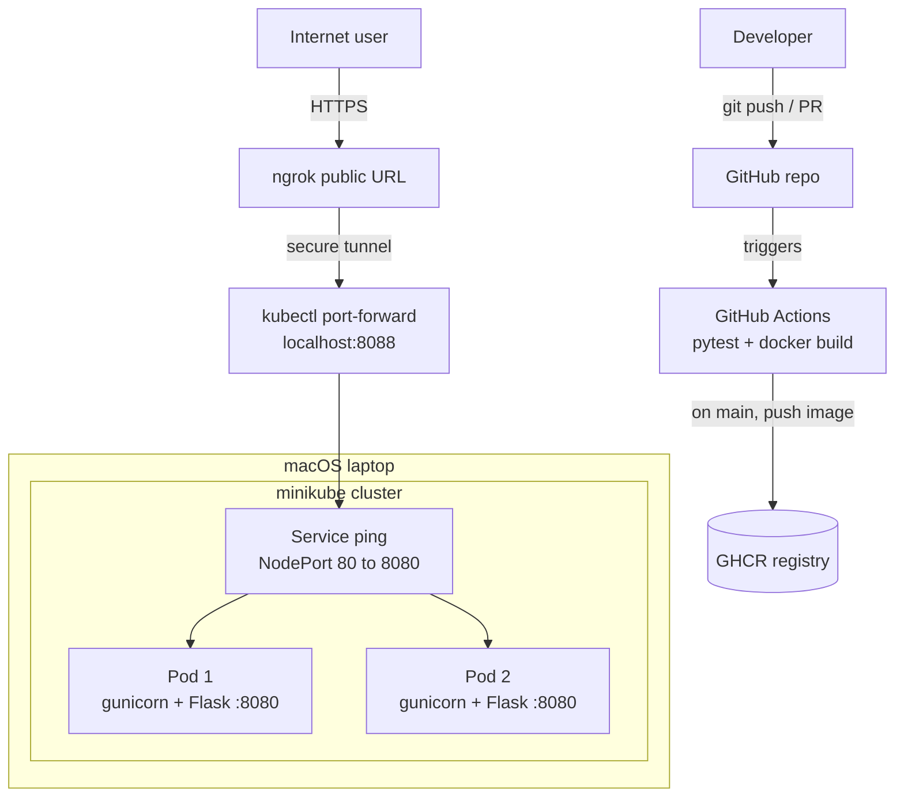

# insider-ping-service

A tiny HTTP service, packaged with Docker, deployed to a single-node
**minikube** Kubernetes cluster and exposed to the internet via **ngrok**.

Built for the Insider One DevOps internship case study. **Track B** (local
minikube + ngrok) — chosen for a fast, zero-cost setup.

## Architecture



There are two flows. The **build & deliver** path: a push or PR triggers GitHub
Actions, which runs the tests and builds the image, and on merges to `main` also
pushes the image to GHCR. The **runtime request** path: an internet request hits
the ngrok public URL, which tunnels to `kubectl port-forward` on the laptop, into
the NodePort Service, which load-balances across the two pods (gunicorn → Flask).

## Endpoints

| Method | Path       | Response          | Purpose                              |
|--------|------------|-------------------|--------------------------------------|
| GET    | `/ping`    | `pong`            | Cheap smoke test                     |
| GET    | `/healthz` | `{"status":"ok"}` | Health endpoint for Kubernetes probes|

## Tech stack

- **Python 3.12 / Flask** — the HTTP service
- **gunicorn** — production WSGI server (not Flask's dev server)
- **Docker** — multi-stage build, runs as a non-root user
- **Kubernetes / minikube** — Deployment + Service (NodePort)
- **GitHub Actions** — CI: test, docker build, and image push to GHCR
- **ngrok** — exposes the service to the internet

## Configuration

Configuration is read from environment variables (12-factor style).

| Variable | Default | Description                          |
|----------|---------|--------------------------------------|
| `PORT`   | `8080`  | Port the HTTP server listens on      |

See [`.env.example`](.env.example). Never commit a real `.env`.

## Run locally (without Docker)

```bash
python3 -m venv .venv
source .venv/bin/activate
pip install -r requirements.txt
python app.py            # or: PORT=8081 python app.py

curl localhost:8080/ping     # -> pong
curl localhost:8080/healthz  # -> {"status":"ok"}
```

## Run with Docker

```bash
docker build -t insider-ping:local .
docker run --rm -p 8082:8080 insider-ping:local

curl localhost:8082/ping     # -> pong
```

The image uses a **multi-stage build** (build deps stay out of the final image)
and runs as a **non-root** user (`appuser`). Verify:

```bash
docker run --rm insider-ping:local whoami   # -> appuser
```

## Kubernetes (minikube)

The service runs on a single-node **minikube** cluster. Manifests live in
[`k8s/`](k8s):

- **`deployment.yaml`** — runs **2 replicas** of the pod and self-heals (if a
  pod dies, the Deployment recreates it). Includes **liveness** and
  **readiness** probes against `/healthz`, plus CPU/memory requests and limits.
- **`service.yaml`** — a **NodePort** Service that load-balances across the
  pods and exposes the app on node port `30080`.

```bash
# Start a local cluster (Docker driver).
minikube start --driver=docker

# Build the image, then load it INTO minikube so the cluster can use it
# without pulling from a registry. (This is why imagePullPolicy is IfNotPresent.)
docker build -t insider-ping:local .
minikube image load insider-ping:local

# Apply both manifests.
kubectl apply -f k8s/

# Verify: both pods should be 1/1 Running.
kubectl get pods
kubectl get svc

# Open a tunnel to the Service and test through Kubernetes.
minikube service ping --url        # prints e.g. http://127.0.0.1:62634
curl http://127.0.0.1:<port>/ping  # -> pong
```

> **Gotcha:** minikube has its own Docker daemon, separate from your host's.
> An image you built locally is invisible to the cluster until you run
> `minikube image load`. Skipping this step causes `ImagePullBackOff`.

## CI (GitHub Actions)

The pipeline lives in [`.github/workflows/ci.yml`](.github/workflows/ci.yml)
and runs on every push and pull request to `main`:

1. **build-and-test** — checks out the code, sets up Python 3.12, installs
   runtime + dev dependencies, runs the test suite with `pytest`, and finally
   builds the Docker image (so a broken Dockerfile also fails CI).
2. **publish-image** *(bonus)* — after the tests pass, on pushes to `main`,
   builds and pushes the image to **GitHub Container Registry (GHCR)** at
   `ghcr.io/<owner>/insider-ping`, tagged `latest` and the commit SHA. It
   authenticates with the built-in `GITHUB_TOKEN`, so no extra secrets are
   needed.

Tests use Flask's test client (`test_app.py`) — no network or running server
required.

## Expose to the internet (ngrok)

The cluster runs locally, so the service is published to the public internet with
an **ngrok** tunnel. A `kubectl port-forward` maps a fixed local port to the
Service, and ngrok exposes that port over HTTPS:

```bash
# Terminal A — forward a local port to the Service (keep it running).
kubectl port-forward svc/ping 8088:80

# Terminal B — open a public HTTPS tunnel to that port (keep it running).
ngrok http 8088
```

ngrok prints a public URL such as `https://<random>.ngrok-free.dev`. Test it:

```bash
curl https://<random>.ngrok-free.dev/ping     # -> pong
curl https://<random>.ngrok-free.dev/healthz  # -> {"status":"ok"}
```

> The free ngrok URL is **ephemeral**: it changes on every restart and is only
> live while `ngrok` is running. The demo screenshot below is the durable proof.

Request path: **internet → ngrok → `localhost:8088` (port-forward) → NodePort
Service → one of the pods → gunicorn → Flask.**

## Demo

`/ping` returning `pong` through the public ngrok URL:


## Branching

- `main` — always deployable.
- `feature/*` — one branch per piece of work, merged into `main` via PR.

## Project structure

```
.
├── app.py                 # Flask service (/ping, /healthz)
├── test_app.py            # pytest smoke tests
├── requirements.txt       # pinned runtime dependencies
├── requirements-dev.txt   # test-only dependencies (pytest)
├── Dockerfile             # multi-stage, non-root, gunicorn
├── .dockerignore
├── .env.example
├── k8s/                   # Kubernetes manifests
│   ├── deployment.yaml    # 2 replicas, probes, resource limits
│   └── service.yaml       # NodePort Service
├── .github/workflows/
│   └── ci.yml             # CI: test + docker build + GHCR push
└── docs/                  # architecture / demo assets
```

## Decisions log

- **Flask** for a tiny, readable service the team can recognize quickly.
- **gunicorn** instead of Flask's dev server — production-grade, multi-worker.
- **Pinned dependency versions** for reproducible builds.
- **Multi-stage Docker build** to keep the final image small and reduce attack surface.
- **Non-root container user** for least-privilege security.
- **`exec gunicorn` in CMD** so gunicorn is PID 1 and handles SIGTERM (graceful shutdown).
- **Config via environment variables** (12-factor) — e.g. `PORT`.
- **Track B (minikube + ngrok)** for a fast, zero-cost public URL.
- **Kubernetes probes on `/healthz`** — liveness for self-healing, readiness so traffic only reaches ready pods.
- **NodePort Service** to expose the app inside the single-node minikube cluster.
- **Separate `requirements-dev.txt`** so test tooling stays out of the runtime image.
- **CI pushes to GHCR only on `main`** (not on PRs) to keep the registry clean.
- **`kubectl port-forward` + ngrok** for a stable local port behind a public HTTPS tunnel.
